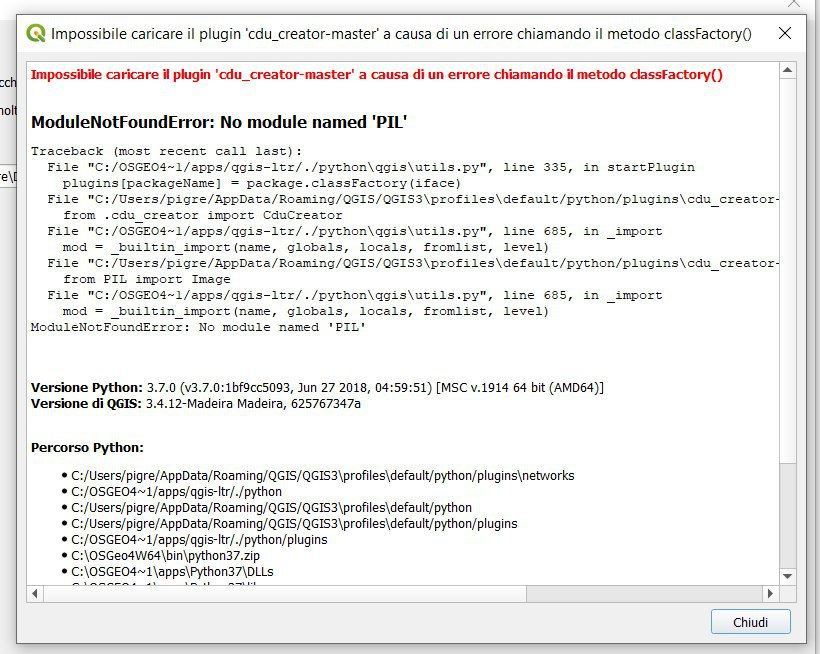
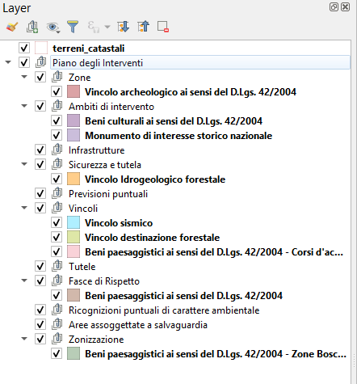
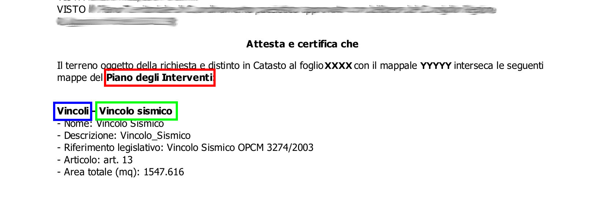
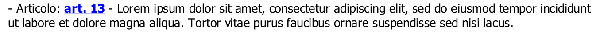
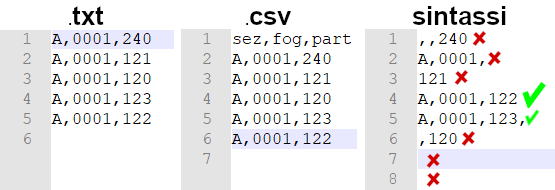
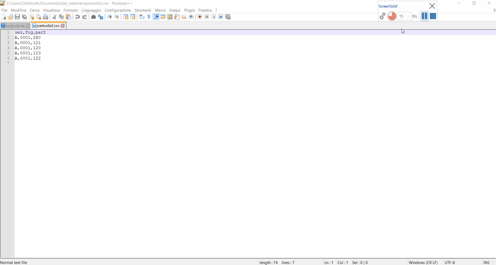
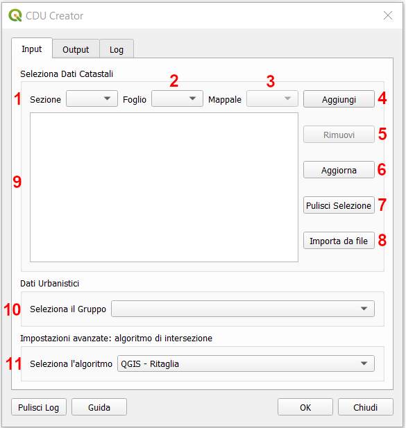
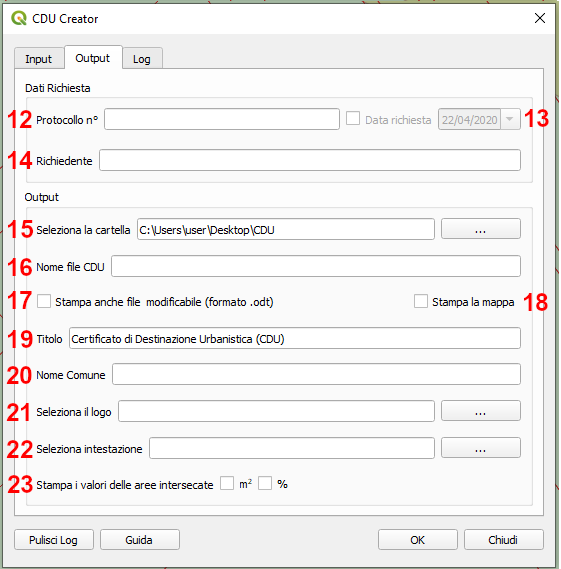
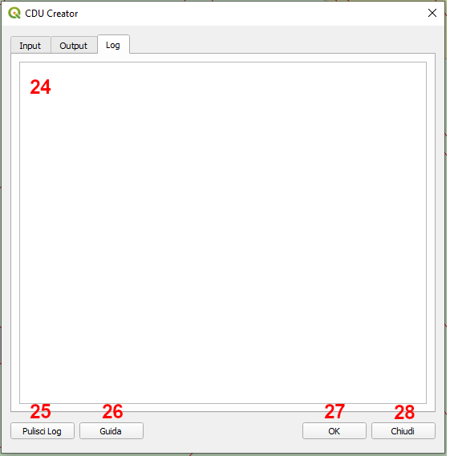
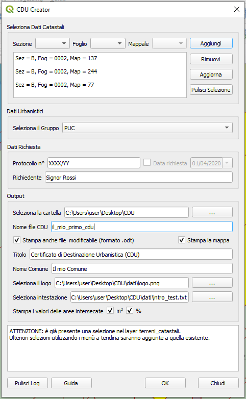

Il Plugin CDU Creator
==================================
Il **Plugin CDU Creator** genera automaticamente il Certificato di Destinazione Urbanistica (CDU) a partire dal layer vettoriale dei terreni catastali e dai layers vettoriali dello strumento urbanistico vigente (PUC, PRG, ecc.). L'output finale è un file .pdf contenete tutte le informazioni relative allo strumento urbanistico recuperate dalle tabelle degli attributi dei layers che si intersecano con la particella catastale selezionata dall'utente.

.. note:: Dalla **versione 1.0** del Plugin è possibile selezionare più particelle catastali e compilare il CDU per le particelle selezionate in un unico processo.

I principali input del Plugin CDU Creator sono i dati dei terreni catastali, che devono essere caricati all'interno di un progetto QGIS come layer vettoriale poligonale, e i dati relativi allo strumento urbanistico vigente anch'essi da caricare nel progetto QGIS come layer vettoriali poligonali. Per il corretto funzionamento del Plugin, il layer dei terreni catastali deve essere obbligatoriamente nominato **terreni_catastali**, mentre i layers dello strumento urbanistico dovranno essere organizzati in gruppi e sottogruppi (n.b. per la corretta organizzazione dei dati al fine di consentire il corretto funzionamento del plugin, si rimanda al paragrafo  :ref:`preparazione-dati`)

Il Plugin compila il CDU per le particelle catastali selezionate nel layer **terreni_catastali**. L'utente può selezionare la particelle con i comuni strumenti di selezione di QGIS oppure utilizzando l'interfaccia grafica del plugin, selezionando l'eventuale sezione dal menù a tendina, il foglio e quindi il numero della particella dai relativi menù a tendina e quindi premendo il pulsante *Aggiungi*. Qualora l'utente selezioni una o più particelle con gli strumenti di selezione di QGIS e anche tramite i menù dell'interfaccia grafica, le eventuali particelle selezionate tramite interfaccia verranno aggiunte alla selezione esistente. Per maggiori informazioni sui metodi di selezione dei mappali per cui si vuole compilare il CDU, si rimanda al paragrafo :ref:`selezione-mappali`.

Come già anticipato nell'introduzione di questo manuale, l'output finale del plugin è un file .pdf, e se specificato anche una versione modificabile in formato .odt, contenete le informazioni necessarie per la creazione del CDU. L'utente può ad esempio indicare i dati relativi alla richiesta di compilazione del CDU come il numero di protocollo, la data della richiesta e il nome del richiedente. Il file .pdf può essere inoltre personalizzato aggiungendo ad esempio un titolo, un logo e una sezione testuale semplicemente inserendo il testo che dovrà comparire come titolo, selezionando un file (.png o .jpg) da usare come logo e un file .txt per la sezione testuale. Questi elementi devono essere definiti tramite l'interfaccia grafica (si veda il pragrafo :ref:`graphical-user-interface` per maggiori dettagli). Una volta indicati il titolo, il file del logo e il file della sezione testuale queste informazioni, insieme al percorso alla cartella dove dovrà essere salvato il file del CDU, saranno memorizzate e quindi riproposte al successivo avvio del plugin. Qualora si volessero modificare queste impostazioni, sarà sufficente selezionare nuovi file o modificare il titolo o eventualmente rimuoverli e la nuova configurazione sarà riproposta al successivo avvio del plugin.

Gli input obbligatori del Plugin **CDU Creator** sono:

* almeno una particella selezionata nel layer *terreni_catastali*;
* un gruppo contenente i layers dello strumento urbanistico;
* il percorso a una cartella di output in cui salvare il file .pdf del CDU

.. _nomenclatura:

Il pdf finale del CDU e l'eventuale odt, saranno quindi salvati nella cartella indicata dall'utente e saranno nominati con il nome file indicato dall'utente tramite l'interfaccia grafica del plugin. Se non venisse indicato un nome per il file pdf/odt del CDU, questi verranno automaticamente nominati con una la seguente nomenclatura:

* **CDU_ggmmaaaa_hhmmss.pdf** - verranno indicati la data e l'ora di creazione del file. 

.. warning:: **Il Plugin CDU Creator non risolve le problematiche relative alla corretta georeferenziazione del catasto.** Eventuali aggiustamenti sulla posizione delle singole particelle, affinchè siano georiferite in modo corretto e coerenti con i layers dello strumento urbanistico, possono e devono essere fatti a priori servendosi degli strumenti di QGIS.

.. warning:: **Il Plugin CDU Creator non gestisce l'aggiornamento dei dati catastali.** In caso di dubbi sull'aggiornamento dei propri dati è ovviamente possibile consultare con QGIS il servizio WMS del catasto fornito dall'Agenzia delle Entrate con licenza CC-BY-NC-ND 4.0, reperibile a questa URL https://wms.cartografia.agenziaentrate.gov.it/inspire/wms/ows01.php .
Ovviamente il servizio WMS non può essere utilizzato al posto del layer *terreni_catastali*, ma può essere confrontato con i propri dati delle particelle catastali, verificare quindi se sono aggiornati ed eventualmente richiedere i nuovi dati.

Installazione
--------------------------------------------
Il Plugin **CDU Creator** è stato approvato da parte del Team di QGIS, pertanto è disponibile dalla repository ufficiale di QGIS e può essere installato con la procedura standard per l’installazione dei Plugin di QGIS. Da menù Plugins –> Gestisci e installa Plugin –> Non Installati. Digitando anche solo parte del nome del plugin nel form di ricerca, è possibile selezionare il plugin dall’elenco e premendo su Installa plugin si procede all’installazione.

**ATTENZIONE!!** Se QGIS restituisce un errore in fase di installazione del Plugin simile a quello mostrato nella figura sotto, il problema è dovuto all'installazione di QGIS. Questo errore può essere dovuto a:

* QGIS è stato installato da *OSGeo4W Network Installer* e non è stata selezionata la versione *qgis-full o qgis-ltr-full*, possono quindi mancare alcune dipendenze python necessarie per questo plugin e anche per altri. **In questo caso è necessario riaprire l'installer e selezionare il pacchetto qgis-full o qgis-ltr-full.**

* Installazione di QGIS su macOS. L'installer per macOS non installa automaticamente alcune dipendenze python necessarie per questo plugin e anche per altri. **In particolare non viene installata la libreria python-pillow che deve essere quindi installata separatamente seguendo le istruzioni riportate sotto:**

  1. Disinstallare il plugin CDU Creator da QGIS e chiudere QGIS.

  2. Da terminale e nelle vesti di (superuser sudo) procedere con l'installazione

  3. Installare python-pillow digitando sul terminale **sudo pip3 install pillow**

  4. Lanciare python 3 digitando sul terminale **python3**

  5. Importare la libreria digitando sul terminale **import PIL**

  6. Chiudere python 3 digitando sul terminale **quit()**

  7. Avviare QGIS

  8. Installare il plugin CDU Creator

Le istruzioni per l'installazione della libreria python-pillow su macOS sono state gentilmente fornite e condivise da **Ivano Giuliano.**

.. _preparazione-dati:

Preparazione dei Dati
--------------------------------------------
Per il corretto funzionamento del Plugin **CDU Creator** è ncessario preparare e organizzare i dati all'interno del progetto QGIS in modo appropriato.

In generale, sia il layer dei terreni catastali sia i layers dello strumento urbanistico devono essere layer vettoriali poligonali (shapefile, GeoPackage, tabella PostGIS, ecc.). Il primo deve essere necessariamente nominato **terreni_catastali** altrimenti il plugin restituirà un messaggio di errore all'avvio segnalando appunto la mancanza di un layer nominato *terreni_catastali* all'interno del progetto QGIS. I layers dello strumento urbanistico invece, devono essere necessariamente inseriti all'interno di un gruppo nel quale NON deve essere inserito invece il layer *terreni_catastali*.

.. image:: img/import_layer.gif

.. note:: Il layer terreni_catastali e i layers dello strumento urbanistico possono avere sistemi di riferimento diversi.

.. warning:: Al momento, nel caso in cui i layers dello strumento urbanistico avessero un sistema di riferimento non proiettato, il calcolo dell'area restituirà il valore in gradi quindi, la stampa del valore dell'area sul file CDU non risulterà corretto.

Layer Terreni Catastali
+++++++++++++++++++++++
Come già detto, il layer contenente le geometrie poligonali delle particelle catastali deve essere nominato **terreni_catastali** e deve essere caricato nel progetto QGIS senza inserirlo in alcun gruppo di layer. Non è necessario che il file dei terreni sia nominato *terreni_catastali* ma è sufficiente che sia rinominato il layer una volta caricato il file nel progetto QGIS (es. il file catasto.shp genera un layer nominato 'catasto' una volta caricato nel progetto QGIS, rinominando il layer in *terreni_catastali* il plugin funzionerà in modo corretto senza dover modificare il nome del file). 

.. note:: Il layer dei terreni_catastali deve contenere le particella appartenenti a un singolo comune per evitare ambiguità nella selezione della particelle soprattutto tramite l'interfaccia grafica. Qualora infatti venissero trovate più particelle con stesso valore di foglio e mappale, il plugin restituirà un messaggio di warning nell'area di Log.

Il layer *terreni_catastali* deve necessariamente contenere nella relativa tabella degli attributi almeno due colonne di **tipo testo**, una in cui deve essere indicato il numero di foglio catastale e una in cui deve essere indicato il numero del mappale delle singole particelle. Se la colonna con i valori di foglio e quella con i valori del mappale sono obbligatorie, una terza colonna (di tipo testo) con il valore della sezione catastale è invece facoltativa. Può quindi essere presente in tabella oppure no. La colonna contenete la sezione, se presente, può eventualmente essere lasciata vuota qualora il catasto non sia suddiviso in sezioni. Se la colonna con nome/alias non viene trovata, il relativo menù a tendina sarà disabilitato e verrà stampato un messaggio informativo nell'area di log per informare l'utente che appunto la colonna sezione non è stata trovata.

La colonna contenente il valore della sezione catastale, se presente, deve avere **nome o alias** = **sezione** (sia il nome che l'alias sono case insensitive ovvero non influenzati dall'uso di lettere maiuscole/minuscole --> è possibile scrivere sezione, SEZIONE, Sezione, SeZiOnE, ecc.). La colonna contenente il numero di foglio catastale deve avere **nome o alias** = **foglio** (sia il nome che l'alias sono case insensitive ovvero non influenzati dall'uso di lettere maiuscole/minuscole --> è possibile scrivere foglio, FOGLIO, Foglio, fOgLiO, ecc.). La colonna contenente il numero di mappale deve avere **nome o alias** = **mappale** (anche in questo caso, sia il nome che l'alias sono case insensitive ovvero non influenzati dall'uso di lettere maiuscole/minuscole --> è possibile scrivere mappale, MAPPALE, Mappale, MaPpAlE, ecc.).

.. warning:: In caso si utilizzino file in formato **ESRIShapefile** si ricorda che questo formato ha delle limitazioni sia nel numero di caratteri per il **nome delle colonne (massimo 10 caratteri)**. Per questo motivo è stata introdotta la possibilità utilizzare gli **alias** invece che rinominare la colonna, con l'alias infatti è possibile utilizzare nomi più lunghi di 10 caratteri. Per vedere come aggiungere l'alias al nome della colonna si rimanda alla `documentazione di QGIS. <https://docs.qgis.org/3.4/it/docs/user_manual/working_with_vector/vector_properties.html#configure-the-field-behavior>`__

.. image:: img/terreni_catastali.gif

Gruppo Layers Strumento Urbanistico
++++++++++++++++++++++++++++
Per quanto riguarda i layers che compongono lo strumento urbanistico, questi devono essere organizzati in gruppi e sottogruppi a seconda della complessità dello strumento stesso. Ad esempio, il PRG di un piccolo Comune composto da pochi layers può essere facilmente organizzato in un soingolo gruppo, mentre il PUC di un grande Comune potrebbe essere organizzato appunto in un gruppo suddiviso in sottogruppi come mostrato nell'immagine sotto.

In ogni caso i layers dello strumento urbanistico devono **necessariamente essere inseriti in un gruppo**, la suddivisione del gruppo in sottogruppi invece è facoltativa.

Gruppo, sottogruppi e layers possono essere nominati liberamente, si consiglia comunque di nominare i vari elementi in modo appropriato dal momento che sia il nome del gruppo che quello dei sottogruppi e layers compariranno nel CDU finale generato dal plugin, come mostrato nello stralcio nell'immagine sotto dove in rosso è indicato il nome del Gruppo, in blu il nome del sottogruppo e in verde il nome del layer.

.. note:: Le geometrie poligonali dei layers dello strumento urbanistico devono essere **geometrie valide e topologicamente corrette** altrimenti c'è la possibilità che il Plugin restituisca un messaggio di errore e che quindi il CDU non venga creato.

Come già anticipato nell'introduzione di questo manuale, nel CDU vengono stampate le informazioni relative alle diverese aree dello strumento urbanistico che intersecano le particelle selezionate. Queste informazioni vengono automaticamente recuperate dalle tabelle degli attributi dei diversi layers dello strumento urbanistico. Per questo motivo, anche la tabelle dei layers dello strumento urbanistico devono essere organizzate in modo tale da consentire il corretto funzionamento del plugin. Il Plugin si aspetta di trovare nelle tabelle degli attributi relative ai singoli layers dello strumento urbanistico una colonna contenete il nome dell'area, una contenente la descrizione, una contenete eventuali riferimenti legislativi ad altre norme e una contenente l'articolo della normativa relativa allo strumento urbanistico.

* La colonna contenete il nome dell'area deve essere di **tipo testo** e deve avere **nome o alias** = **nome** (sia il nome che l'alias sono case insensitive ovvero non influenzati dall'uso di lettere maiuscole/minuscole --> è possibile scrivere nome, NOME, Nome, NoMe, ecc.). Questa colonna non è obbligatoria, se il plugin non trova un colonna nominata o con alias = *nome* semplicemente segnalerà con un messaggio di warning che la colonna non è stata trovata nel relativo layer e quindi non stamperà alcun valore nella riga corrispondente del CDU. Qualora invece esistesse una colonna con *nome o alias* = *nome* nella tabella degli attributi, sono ovviamente ammessi eventuali valori nulli; anche in questo caso il plugin non stamperà alcun valore nella riga corrispondente del CDU.

* La colonna contenete la descrizione deve essere di **tipo testo** e deve avere **nome o alias** = **descrizione** (sia il nome che l'alias sono case insensitive ovvero non influenzati dall'uso di lettere maiuscole/minuscole --> è possibile scrivere descrizione, DESCRIZIONE, Descrizione, DesCRizIOne, ecc.). Questa colonna non è obbligatoria, se il plugin non trova un colonna nominata o con alias = *descrizione* semplicemente segnalerà con un messaggio di warning che la colonna non è stata trovata nel relativo layer e quindi non stamperà alcun valore nella riga corrispondente del CDU. Qualora invece esistesse una colonna con *nome o alias* = *descrizione* nella tabella degli attributi, sono ovviamente ammessi eventuali valori nulli; anche in questo caso il plugin non stamperà alcun valore nella riga corrispondente del CDU.

* La colonna contenete il riferimento legislativo deve essere di **tipo testo** e deve avere **nome o alias** = **riferimento legislativo** (sia il nome che l'alias sono case insensitive ovvero non influenzati dall'uso di lettere maiuscole/minuscole --> è possibile scrivere riferimento legislativo, RIFERIMENTO LEGISLATIVO, Riferimento Legislativo, ecc.). Questa colonna non è obbligatoria, se il plugin non trova un colonna nominata o con alias = *nome* semplicemente segnalerà con un messaggio di warning che la colonna non è stata trovata nel relativo layer e quindi non stamperà alcun valore nella riga corrispondente del CDU. Qualora invece esistesse una colonna con *nome o alias* = *riferimento legislativo* nella tabella degli attributi, sono ovviamente ammessi eventuali valori nulli; anche in questo caso il plugin non stamperà alcun valore nella riga corrispondente del CDU.

* La colonna contenete l'articolo della normativa urbanistica deve essere di **tipo testo** e deve avere **nome o alias** = **articolo** (sia il nome che l'alias sono case insensitive ovvero non influenzati dall'uso di lettere maiuscole/minuscole --> è possibile scrivere articolo, ARTICOLO, Articolo, ArTiCoLo, ecc.). Questa colonna non è obbligatoria, se il plugin non trova un colonna nominata o con alias = *articolo* semplicemente segnalerà con un messaggio di warning che la colonna non è stata trovata nel relativo layer e quindi non stamperà alcun valore nella riga corrispondente del CDU. Qualora invece esistesse una colonna con *nome o alias* = *articolo* nella tabella degli attributi, sono ovviamente ammessi eventuali valori nulli; anche in questo caso il plugin non stamperà alcun valore nella riga corrispondente del CDU.

.. note:: Le colonne **nome, descrizione, riferimento legislativo e articolo** possono essere aggiunte ai layers dello strumento urbanistico anche tramite **un'operazione di join**. Per vedere come creare un Join si rimanda alla `documentazione di QGIS. <https://docs.qgis.org/3.4/it/docs/user_manual/working_with_vector/vector_properties.html#joins-properties>`__

.. image:: img/lay_urbanistici.gif

All'interno delle colonne il testo può essere formattato come HTML quindi servendosi dei vari <tag> html per dare particolari effetti al testo (es. bold, italic, ecc.), per impaginare il testo con a capo, elenchi ecc. ed eventualmente per aggiungere link a pagine web nel testo. In particolar modo la possibilità di formattare il testo come HTML può essere molto utile soprattutto per rendere più facilmente leggibile il contenuto della colonna *articolo*. Qui infatti può essere inserito l'intero testo dell'articolo di riferimento della normativa (attenzione al limite di caratteri possibili soprattutto nel caso in cui vengano usati degli Shapefile) oppure, qualora la normativa fosse disponibile su una pagina web, inserire tramite l'utilizzo di HTML un link alla pagina puntando direttamente al testo dell'articolo. Il link verrà ovviamente stampato nel file pdf del CDU e da lì sarà possibile cliccare e essere automaticamente reindirizzati alla pagine web della normativa.

Ad esempio le riga di codice html sotto verrà stampata come mostrato nell'immagine seguente

.. code-block:: html

  <b><a href="https://www.gter.it/">art. 13</a></b> - Lorem ipsum dolor sit amet, consectetur adipiscing elit, sed do eiusmod tempor incididunt ut labore et dolore magna aliqua. Tortor vitae purus faucibus ornare suspendisse sed nisi lacus.

.. hint:: In caso si utilizzino file in formato **ESRIShapefile** si ricorda che questo formato ha delle limitazioni sia nel numero di caratteri per il **nome delle colonne (massimo 10 caratteri)**, sia nel numero di caratteri per i **valori dei campi testuali (massimo 255 caratteri)**. Per questo motivo è stata introdotta la possibilità utilizzare gli **alias** invece che rinominare la colonna, con l'alias infatti è possibile utilizzare nomi più lunghi di 10 caratteri. Per vedere come aggiungere l'alias al nome della colonna si rimanda alla `documentazione di QGIS. <https://docs.qgis.org/3.4/it/docs/user_manual/working_with_vector/vector_properties.html#configure-the-field-behavior>`__ Per quanto riguarda invece il limite di caratteri per il contenuto delle celle (massimo 255 caratteri in caso di file in formato ESRI Shapefile), si consiglia di utilizzare altri formati vettoriali (es. GeoPackage).

.. _selezione-mappali:

La selezione delle particelle
--------------------------------------------
La selezione della o delle particelle catastali per le qualis is vuole compilare il CDU può essere fatta secondo due modalità:

#. tramite gli strumenti di selezione di QGIS
#. tramite gli strumenti disponibili dall'interfaccia grafica del Plugin

Strumenti di selezione di QGIS
+++++++++++++++++++++++++++++++++
Utilizzando gli strumenti di selezione di QGIS (*Seleziona Elementi con un rettangolo o con un singolo click, Seleziona Elementi con un Poligono, Seleziona Elementi a Mano Libera, Seleziona Elementi con un Cerchio, Seleziona con espressione, ecc.*), le particelle possono essere selezionate sia prima di avviare l'interfaccia del plugin cliccando sull'icona nella toolbar, sia dopo l'avvio dell'interfaccia del plugin. Infatti, cliccando sull'icona nella toolbar verrà aperta l'interfaccia del plugin ma la finestra di QGIS resterà attiva e quindi utilizzabile. Se **la selezione è stata fatta prima dell'avvio del plugin**, una volta avviato verranno elencate nell'area di testo dedicata le infromazioni (foglio, mappale e eventuale sezione) relative alle particelle selezionate. Qualora invece **la selezione venga fatta a interfaccia già attiva**, sarà possibile ottenere l'elenco delle particelle selezionate nell'area di testo dedicata semplicemente premendo il tasto **Aggiorna** sull'interfaccia del plugin.

.. note:: Per quanto riguarda l'utilizzo degli strumenti di selezione di QGIS si rimanda alla `documentazione. <https://docs.qgis.org/3.4/it/docs/user_manual/introduction/general_tools.html#selecting-features>`__

.. image:: img/strumenti_selez.gif

Strumenti di selezione da Interfaccia del plugin
++++++++++++++++++++++++++++++++++++++++++++++++
Per seleziona la o le particelle per la quali si vuole compilare il CDU da interfaccia grafica del Plugin, bisogna indicare la particella di interesse utilizzando i menù a tendina *Sezione, Foglio e Mappale*. Come già detto se non è presente nel layer terreni_catastali una colonna *sezione*, il menù corrispondente non viene attivato. E' necessario invece selezionare almeno il *foglio* e il *mappale* per procedere alla selezione. Una volta indicata la particella tramite i menù a tendina, è sufficiente premere il tasto **Aggiungi** per selezionare. Una volta premuto il tasto, la particella viene selezionata, la mappa viene zoommata alla selezione e nell'area di testo dedicata vengono stampate le informazioni relative alla particella. In questo modo è possibile aggiungere tutte le particelle per le quali si vuole compilare il CDU.

.. image:: img/gui_selez.gif

Sempre dall'interfaccia grafica del Plugin è possibile anche selezionare le particelle elencate in un file di testo da importare tramite il bottone **Importa da file**. Cliccando sul bottone si apre una finestra di dialogo tipo esplora risorse da cui sarà possibile navigare all’interno della propria macchina e selezionare un file *.txt/.csv* con l'elenco delle particelle che si vogliono selezionare. Il file di testo deve essere così composto:

* ogni particella deve essere identificata da sezione (se presente), numero di foglio e mappale
* sezione foglio e mappale devono essere **separati dalla virgola** (,)
* devono essere obbligatoriamente indicati **almeno il numero di foglio e mappale** altrimenti la riga sarà ignorata
* una particella per riga
* in caso di file **.txt non deve** essere inserita alcuna intestazione alla prima riga (es. nome delle colonne)
* in caso di file **.csv deve** essere inserita l'intestazione alla prima riga (es. nome delle colonne)
* eventuali righe vuote saranno ignorate

  

Modifica della selezione esistente
++++++++++++++++++++++++++++++++++
Una volta fatta la selezione, con qualsiasi strumento sopra indicato, è ovviamente possibile modificarla, rimuovendo o aggiungendo le particelle alla selezione esistente. I due metodi di selezione sono interoperabili, ciò significa che è possibile fare la selezione tramite gli strumenti di QGIS e rimuovere o aggiungere una o più particelle con gli strumenti dell'interfaccia e viceversa.

**Per RIMUOVERE dalla selezione esistente:**

* tramite gli strumenti di QGIS utilizzando il metodo **Rimuovi dalla selezione attuale** nel caso ad esempio del tool *Seleziona con espressione*, oppure tenendo premuto il **tasto Ctrl** ad esempio con gli strumenti *Seleziona Elementi con un rettangolo o con un singolo click, Seleziona Elementi con un Poligono, ecc.* In questo caso per aggiornare l'elenco delle particelle selezionate nell'area di testo dedicata, è necessario premere il tasto **Aggiorna** dell'interfaccia grafica.
* tramite gli strumenti dell'interfaccia grafica è sufficiente selezionare la particella interessata dai menù a tendina (sezione, foglio e mappale) e premere il tasto **Rimuovi**. In questo caso l'elenco delle particelle selezionate nell'area di testo dedicata si aggiorna automaticamente.

**Per AGGIUNGERE alla selezione esistente:**

* tramite gli strumenti di QGIS utilizzando il metodo **Aggiungi dalla selezione attuale** nel caso ad esempio del tool *Seleziona con espressione*, oppure tenendo premuto il **tasto Shift** ad esempio con gli strumenti *Seleziona Elementi con un rettangolo o con un singolo click, Seleziona Elementi con un Poligono, ecc.* In questo caso per aggiornare l'elenco delle particelle selezionate nell'area di testo dedicata, è necessario premere il tasto **Aggiorna** dell'interfaccia grafica.
* tramite gli strumenti dell'interfaccia grafica è sufficiente selezionare la particella interessata dai menù a tendina (sezione, foglio e mappale) e premere il tasto **Aggiungi**. In questo caso l'elenco delle particelle selezionate nell'area di testo dedicata si aggiorna automaticamente.

.. _graphical-user-interface:

L'Interfaccia Grafica
--------------------------------------------
Tutti parametri necessari per la compilazione del CDU possono essere specificati dall’utente attraverso l’interfaccia grafica del Plugin **CDU Creator** che si apre cliccando sull’icona del plugin nella toolbar.

.. note:: A seconda della dimensione e del numero di geometrie del layer *terreni_catastali*, l'avvio dell'interfaccia grafica del Plugin CDU Creator potrebbe richiedere qualche istante in più del normale.

L'interfaccia grafica è composta da 3 tab:

* **Input** - qui è possibile specificare le particelle per cui compilare il CDU, il gruppo contente i layer dello strumento urbanistico e l'algoritmo con cui verrà fatta l'intersezione tra le particelle selezionate e i layer urbanistici
* **Output** - qui è possibile specificare tutti i parametri per la personalizzazione del CDU (es. dati della richiesta, titolo, nome del Comune, logo, intestazione, ecc.) oltre alla cartella e al nome del file per il salvataggio del file pdf/odt del CDU
* **Log** - qui vengono mostrati tutti i messaggi prodotti dal plugin durante il processo. Questa tab viene visualizzata automaticamente premendo sul tasto OK.

Input
+++++++++++++++

* **1 - Sezione:** il menù a tendina elenca tutti i valori univoci presenti nella colonna *sezione*, se invece la colonna non viene trovata il menù sarà disabilitato. Da qui è possibile selezionare il valore della sezione relativo alla particella per cui si vuole compilare il CDU. No è obbligatorio selezionare la sezione soprattutto se il proprio catasto non è suddiviso in sezioni e quindi la colonna è vuota o comunemente riempita con un trattino '-'. Se presenti nella colonna, sia il valore NULL che l'eventuale '-' compariranno nel menù a tendina ma, come già detto non è necessario selezionarli. Il plugin infatti gestirà autonomamente il valore della sezione se non selezionato tramite il menù a tendina. 
* **2 - Foglio:** il menù a tendina elenca tutti i valori univoci presenti nella colonna *foglio*. Qualora fosse stata precedentemente selezionata una sezione, il menù elencherà tutti i valori univoci della colonna foglio filtrati per il valore di sezione selezionato. Da qui è quindi possibile selezionare il numero di foglio relativo alla particella di cui si vuole compilare il CDU. La selezione del foglio è obbligatoria per poter abilitare il menù a tendina della particella, se non viene selezionato un numero di foglio infatti il menù particella sarà disabilitato.
* **3 - Particella:** il menù a tendina elenca tutti i valori univoci presenti nella colonna *particella* filtrati per il numero di foglio selezionato in precedenza. Da qui è quindi possibile selezionare il numero di particella di cui si vuole compilare il CDU. Il menù a tendina della particella resta disabilitato finchè non viene selezionato un numero di foglio.
* **4 - Aggiungi:** il bottone seleziona e aggiunge alla lista delle particelle selezionate la particella indicata tramite i menù a tendina. Una volta indicata la particella desiderata tramite i menù, è necessario premere il tasto *Aggiungi* altrimenti la particella indicata non verrà selezionata. Una volta premuto sarà possibile vedere la particella selezionata sull'area di mappa e le informazioni relative (sezione, foglio e mappale) stampate nell'area di testo dedicata. 
.. note:: Il pulsante **Aggiungi** aggiunge appunto la particella indicata alla selezione esistente. Se è già presente una selezione, la selezione della particella indicata tramite i menù a tendina sarà aggiunta a quella esistente.
* **5 - Rimuovi:** il bottone rimuove la particella indicata tramite i menù a tendina dalla selezione e dalla lista delle particelle selezionate. Una volta indicata la particella desiderata tramite i menù, è necessario premere il tasto *Rimuovi* altrimenti la particella indicata non verrà rimossa. Una volta premuto sarà possibile vedere la particella deselezionata sull'area di mappa e le informazioni relative (sezione, foglio e mappale) rimosse dall'area di testo dedicata. 
.. note:: Il pulsante **Rimuovi** rimuove appunto la particella indicata dalla selezione esistente. Se è già presente una selezione, la selezione della particella indicata tramite i menù a tendina sarà rimossa da quella esistente. Se non è presente una selezione, il tasto sarà disabilitato.
* **6 - Aggiorna:** il bottone aggiorna la lista delle particelle selezionate consultabile nell'area di testo dedicata. Nel caso in cui una o più particelle vengano aggiunte o rimosse tramite i pulsanti *Aggiungi* o *Rimuovi*, la lista viene aggiornata automaticamente. Nel caso in cui la selezione delle particelle venga modificata tramite gli strumenti di selezione di QGIS con l'interfaccia grafica del plugin già attiva, è possibile aggiornare la lista delle particelle selezionate appunto premendo il tasto *Aggiorna*.
* **7 - Pulisci selezione:** il bottone rimuove la selezione esistente deselezionando tutte le particelle selezionate.
* **8 - Importa da file:** il bottone seleziona tutte le particelle elencate nel file di testo selezionato. Cliccando sul bottone si aprirà una finestra di dialogo tipo esplora risorse da cui sarà possibile navigare all’interno della propria macchina e selezionare un file *.txt/.csv* con l'elenco delle particelle che si vogliono selezionare.
.. note:: Se è già presente una selezione, la selezione della particelle indicate nel file sarà aggiunta a quella esistente.
* **9 - Elenco particelle selezionate:** in quest'area di testo vengono elencate le informazioni (*sezione, foglio e mappale*) relative alle particelle selezionate.
* **10 - Seleziona il Gruppo:** da qui è possibile selezionare il gruppo di layers contenente appunto i layers dello strumento urbanistico che si vuole utilixxare per la compilazione del CDU. Il menù a tendina elenca tutti i gruppi di layers presenti all’interno del progetto corrente.
* **11 - Seleziona l'algoritmo di intersezione:** da qui è possibile selezionare l'agoritmo con cui verrà eseguita l'intersezione fra le particelle catastali selezionate e i layer dello strumento urbanistico. Di default viene selezionato l'algoritmo *Clip* di QGIS, più veloce ma più sensibile a eventuali geometrie non valide. In alternativa è possibile selezionare l'algoritmo *Clip by polygon* di GDAL che in molti casi riesce a processare anche le geometrie con problemi di validità aumentando però i tempi di calcolo. Come già detto, in generale si consiglia comunque di utilizzare layer con geometrie valide e topologicamente corrette. In caso di geometrie con errori infatti, è possibile che anche l'algoritmo *Clip by polygon* di GDAL non riesca a portare a termine il processo. Qualora i problemi delle geometrie non permetessero di portare a termine il processo di intersezione, verrà visualizzato nell'area di Log un messaggio di errore e il CDU non sarà creato.

Output
+++++++++++++++

* **12 - Protocollo n°:** si tratta appunto del numero di protocollo che comparirà nel file CDU. E' sufficiente digitare la dicitura desiderata nel form di testo. Il numero di protocollo non verrà memorizzato e quindi riproposto al successivo avvio del plugin. Sarà quindi necessario inserirlo ogni volta. Il numero di protocollo non è un parametro obbligatorio.
* **13 - Data Richiesta:** si tratta appunto della data in cui è stata fatta la richiesta del CDU da parte del richiedente. Di default questo elemento è disabilitato. Per abilitarlo è sufficiente **spuntare la checkbox** accanto all'etichetta *Data Richiesta* sull'interfaccia grafica del plugin. Una volta abilitato, cliccando sulla freccina comparirà un calendario da cui sarà possibile selezionare la data desiderata. Di default il valore di data indicato è la data corrente, se non modificata verrà quindi inserita nel CDU la data corrente come data della richiesta. La data non verrà memorizzata e quindi riproposta al successivo avvio del plugin. Sarà quindi necessario inserirla ogni volta. La data non è un parametro obbligatorio.
* **14 - Richiedente:** si tratta appunto del nome del richiedente che comparirà nel file CDU. E' sufficiente digitare la dicitura desiderata nel form di testo. Il richiedente non verrà memorizzato e quindi riproposto al successivo avvio del plugin. Sarà quindi necessario inserirlo ogni volta. Il richiedente non è un parametro obbligatorio.
* **15 - Seleziona la cartella:** premendo sul bottone (…) si aprirà una finestra di dialogo tipo esplora risorse da cui sarà possibile navigare all’interno della propria macchina e selezionare la cartella dentro cui si desidera salvare l'output finale del processo (file .pdf del CDU). Una volta selezionata la cartella il percorso a questa comparirà nella stringa di testo accanto al bottone. NB: qualora l’utente non selezionasse una cartella di output, il plugin restituirà un messaggio di errore, il processo verrà bloccato e l’utente avrà la possibilità di selezionare la cartella e successivamente rilanciare il calcolo. Come già detto, la cartella di output è uno dei  parametri che verrà memorizzato e quindi riproposto al successivo avvio del plugin. Qualora si volesse modificare, sarà sufficente selezionare una nuova cartella utilizzando il bottone (...) e il nuovo percorso alla cartella di output sarà memorizzato.
* **16 - Nome file CDU:** è possibile indicare un nome per il file pdf del CDU. E’ necessario indicare solo il nome senza l’estensione del file che verrà aggiunta automaticamente. Come già detto, qualora l’utente non indicasse il nome per il CDU, questo verrà automaticamente nominato con una nomenclatura standard (si veda la sezione sulla :ref:`nomenclatura` dei file per maggiori dettagli). 
.. note:: **Si consiglia di non inserire nel nome del file spazi o caratteri speciali.**
* **17 - Stampa anche file di testo modificabile (formato .odt):** spuntando la checkbox, oltre al file .pdf del CDU verrà anche creata una versione modificabile del CDU ovvero un file di testo modificabile in formato .odt.
* **18 - Stampa la mappa:** spuntando la checkbox, verrà stampata nel CDU l'area di mappa centrata sulle particelle selezionate.
* **19 - Titolo:** si tratta appunto del titolo che comparirà nel file CDU. Di default il titolo è 'Certificato di Destinazione Urbanistica (CDU)' ma è sufficiente digitare il titolo che si desidera nel form di testo. Come già detto, il titolo è uno dei  parametri che verrà memorizzato e quindi riproposto al successivo avvio del plugin. Qualora si volesse modificare, sarà sufficente cambiare il testo e il nuovo titolo sarà memorizzato. Il titolo non è un parametro obbligatorio.
* **20 - Nome Comune:** si tratta appunto del nome del Comune che comparirà nel file CDU. E' sufficiente digitare il nome del Proprio Comune (es. Genova, Piana Crixia, Vicenza, ecc.) nel form di testo. Come già detto, il nome del Comune è uno dei  parametri che verrà memorizzato e quindi riproposto al successivo avvio del plugin. Qualora si volesse modificare, sarà sufficente cambiare il testo e il nuovo nome sarà memorizzato. Il nome Comune non è un parametro obbligatorio.
* **21 - Seleziona il Logo:** premendo sul bottone (…) si aprirà una finestra di dialogo tipo esplora risorse da cui sarà possibile navigare all’interno della propria macchina e selezionare un file *.png/.jpg* con il logo del proprio Comune o qualsisi immagine si desideri che verrà quindi stampato sopra al titolo nel CDU. Una volta selezionato, il percorso al file comparirà nella stringa di testo accanto al bottone. Come già detto, il logo è uno dei  parametri che verrà memorizzato e quindi riproposto al successivo avvio del plugin. Qualora si volesse modificare, sarà sufficente selezionare un nuovo file utilizzando il bottone (...) e il nuovo percorso al file ..png/.jpg sarà memorizzato. Qualora invece non si volesse più stampare il logo nel CDU è sufficiente cancellare dal form di testo accanto al bottone il percorso al file. Il logo non è un parametro obbligatorio.
* **22 - Seleziona intestazione:** premendo sul bottone (…) si aprirà una finestra di dialogo tipo esplora risorse da cui sarà possibile navigare all’interno della propria macchina e selezionare un file *.txt* contenente uno testo con eventuali riferimenti legislativi, diciture varie ed eventuali, introduzione al documento, ecc.. Una volta selezionato il file .txt il percorso al file comparirà nella stringa di testo accanto al bottone. Come già detto, l'intestazione è uno dei  parametri che verrà memorizzato e quindi riproposto al successivo avvio del plugin. Qualora si volesse modificare, sarà sufficente selezionare un nuovo file .txt utilizzando il bottone (...) e il nuovo percorso al file .txt sarà memorizzato. Qualora invece non si volesse più stampare l'intestazione nel CDU è sufficiente cancellare dal form di testo accanto al bottone il percorso al file. L'intestazione non è un parametro obbligatorio.
* **23 - Stampa i valori delle aree intersecate:** il plugin calcola l'area (|m2| e/o %) di intersezione fra le singole geometrie di ogni layer dello strumento urbanistico che si intersecano con la particella selezionata. Spuntando la checkbox |m2|, verrà quindi stampata nel CDU l'area espressa in |m2|, spuntando la checkbox % verrà stampata l'area espressa in percentuale. E' possibile spuntare solo una o entrambe le checkbox. Se ne viene spuntata solo una, ovviamente verrà stampato solo il valore relativo alla checkbox spuntata. Se vengono spuntate entrambe, verranno stampati entrambi i valori. Se invece nessuna checkbox viene spuntata, il valore dell'area non comparirà nel CDU.

Log
+++++++++++++++

* **24 - Messaggi di Log:** tutti i messaggi di warning o di errore così come i messaggi informativi sull'andamento del processo compariranno in questa area.
* **25 - Pulisci Log:** il bottone pulisce l’area dei messaggi di Log rimuovendo eventuali messaggi di processi precedenti.
* **26 - Guida:** il bottone apre questo manuale in un web browser.
* **27 - OK:** il bottone lancia il processo. Come già detto, se il plugin restituisce un messaggio di errore il processo viene bloccato e l’utente potrà inserire o modificare i parametri in input, premendo nuovamente il bottone OK il processo verrà rilanciato.
* **28 - Chiudi:** il bottone chiude l’interfaccia grafica del plugin e i parametri in input numero foglio, numero particella e gruppo sono riinizializzati.

Esempio
--------------------------------------------
Una volta organizzati i dati seguendo le indicazioni riportate nel paragrafo :ref:`preparazione-dati` è possibile utilizzare il **Plugin CDU Creator**. Ricapitolando, i requisiti necessari che i dati (terreni catastali e strumento urbanistico) devono avere per il corretto funzionamento del plugin sono:

* layer delle particelle catastali nominato **terreni_catastali**;
* il layer *terreni_catastali* deve necessariamente avere due colonne rispettivamente nominate **foglio e mappale**;
* il layer *terreni_catastali* può avere anche una colonna nominata **sezione**;
* le colonne **foglio e mappale** nel layer *terreni_catastali* **sono obbligatorie** mentre la colonna **sezione** è facoltativa;
* i layers dello strumento urbanistico devono essere inseriti in un **gruppo** e eventualmente organizzati in sottogruppi;
* le informazioni relative ai layers dello strumento urbanistico devono essere inserite in quattro colonne della relativa tabella degli attributi rispettivamente nominate **nome, descrizione, riferimento legislativo, articolo**;
* le quattro colonne nei layers dello strumento urbanistico **NON sono obbligatorie**.

.. note:: Il dataset di esempio, già pronto per l'utilizzo del plugin, è stato realizzato da **Salvatore Fiandaca** (https://pigrecoinfinito.wordpress.com/) ed è scaricabile qui :download:`zip <dati/dati_test_CDU.zip>`. Il dataset è stato creato usando parte dei dati presenti nel plugin **CXF_in** (https://github.com/saccon/CXF_in) di **Fabio Saccon**.

.. image:: img/process_multi.gif

Impostare quindi i vari parametri in input dall'interfaccia grafica del Plugin **CDU Creator**.

Come già detto, la particella per cui si vuole compilare il CDU può essere selezionata con gli strumenti di selezione di QGIS oppure servendosi dei menù a tendina dell'interfaccia grafica. In questo caso la particella è stata selezionata tramite i menù a tendina dell'interfaccia grafica. Essendo il catasto utilizzato come test suddiviso in sezioni, è presente nel layer terreni_catastali anche la colonna nominata sezione. E’ stata quindi selezionata anche la sezione per evitare di incorrere in un messaggio di warning che avvisa l'utente che sono state trovate più particelle con stesso numero di foglio e mappale. Se i dati catastali di test non fossero stati suddivisi in sezioni, sarebbe stato sufficiente selezionare solo il foglio e il mappale.

Una volta definiti i vari parametri in input, premendo il tasto OK il processo sarà avviato, eventuali messaggi di warning o informativi verranno stampati nell'area di Log, in caso di problematiche che compromettono la corretta compilazione del CDU, il processo si interrompe restituendo un messaggio che descrive la problematica riscontrata.

.. image:: img/fine_processo_multi.png

Una volta terminato il processo, l'area di mappa viene automaticamente zoommata sulla particella selezionata. In questo caso ad esempio, il Plugin restituisce due messaggi di warning che comunicano all'utente che la colonna *descrizione* non è stata trovata in un certo layer dello strumento urbanistico e la colonna *nome* non è stata trovata in un altro layer dello strumento urbanistico.

Se il processo va a buon fine, comparirà la scritta **PROCESSO TERMINATO** preceduta da un messaggio che indica all'utente in quale cartella è stato salvato il CDU e il nome del file.

.. image:: img/cdu_multi.png
  :align: center

L'output finale è un file PDF (eventualmente multipagina a seconda del contenuto da stampare) contenete tutte le informazioni estratte dai layers dello strumento urbanistico e tutte le personalizzazioni e parametri (titolo, nome comune, logo, intestazioni, n° di protocollo, data, richiedente, ecc.) definiti dall'utente.

.. seealso:: Di seguito il video tutorial realizzato da **Salvatore Fiandaca** (https://pigrecoinfinito.wordpress.com/) sull'utilizzo del Plugin CDU Creator:

.. raw:: html

    

        <video controls src="_static/CDU_finale.mp4" style="max-width: 100%;"></video>
    

.. |m2| replace:: m\ :sup:`2`\
